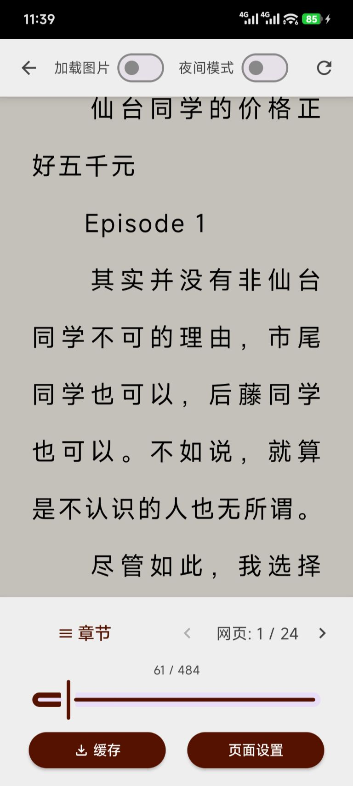
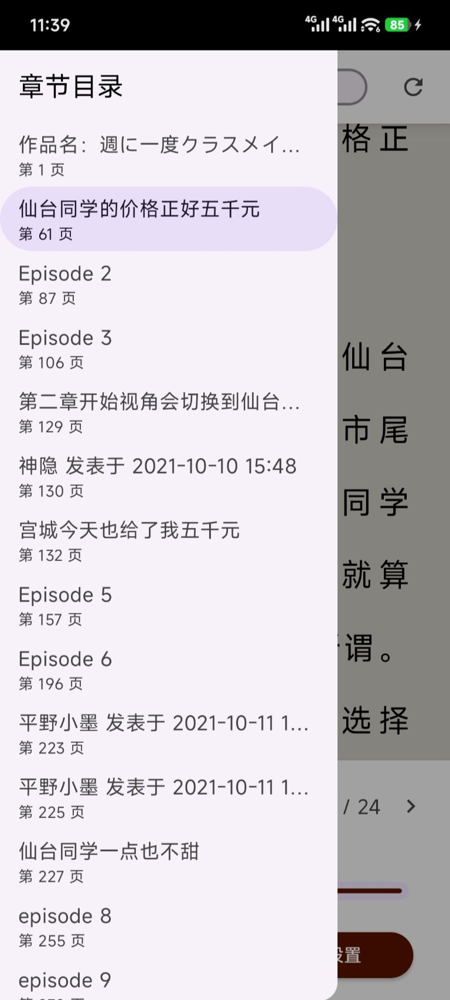

# 300文学阅读器

为百合会论坛小说提供更好的阅读体验

系统要求: Android 7.0及以上

## 内容列表

- [已知问题](#已知问题)
- [软件下载](#软件下载)
- [开源许可](#开源许可)
- [如何贡献](#如何贡献)
- [使用许可](#使用许可)

## 已知问题

1. 我没有多个账号，目测换账号登录肯定会出问题，要换的话一定要把数据清除。

## 软件下载

[Github Release](https://github.com/34256346/YamiboReaderPro/releases)

## 软件截图

  
  
  
  
  
  

## 开源许可

架构: [Jetpack Compose](https://developer.android.com/jetpack/compose)

网络: [Retrofit](https://github.com/square/retrofit)

网络: [Okhttp3](https://github.com/square/okhttp)

HTML解析: [Jsoup](https://github.com/jhy/jsoup)

JSON解析: [FastJSON2](https://github.com/alibaba/fastjson2)

图片显示: [coil](https://github.com/coil-kt/coil)

拖拽排序: [Reorderable](https://github.com/Calvin-LL/Reorderable)

## 维护者

[@34256346](https://github.com/34256346)

## 原项目 

本项目 Fork 自 [flben233/YamiboReader](https://github.com/flben233/YamiboReader)。 感谢原作者 [@flben233](https://github.com/flben233) 的出色工作。

## 如何贡献

非常欢迎你的加入！[提一个 Issue](https://github.com/flben233/YamiboReader/issues/new) 或者提交一个 Pull Request。

## 使用许可

[AGPL 3.0](LICENSE) © flben233

