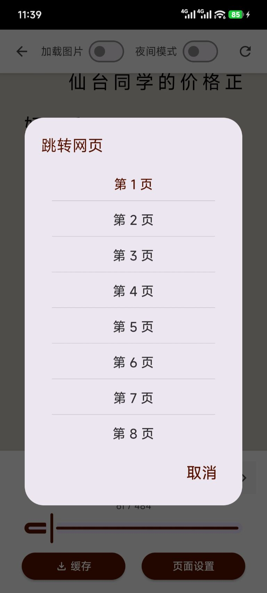
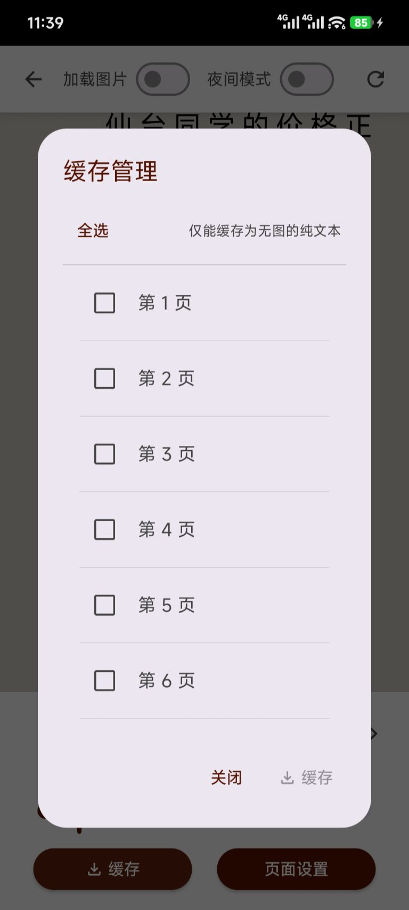
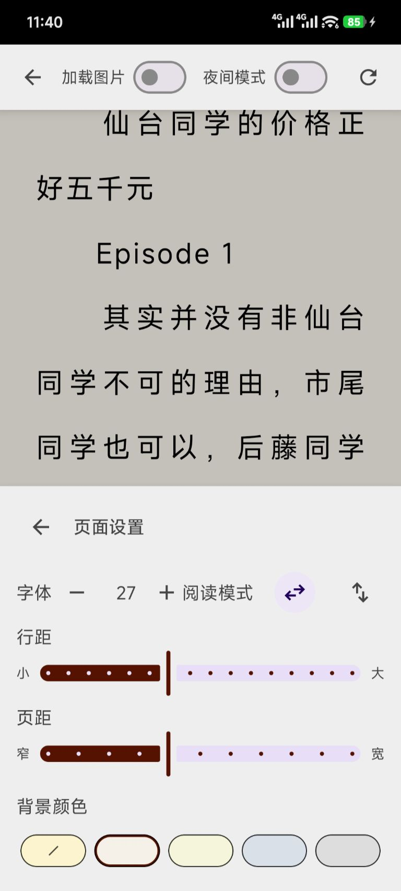
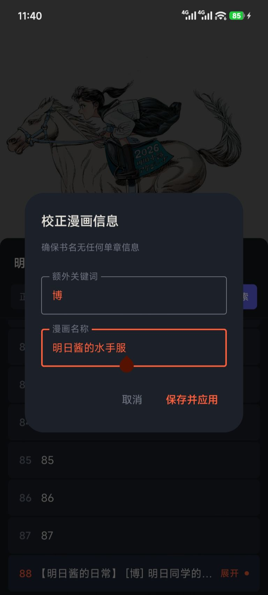
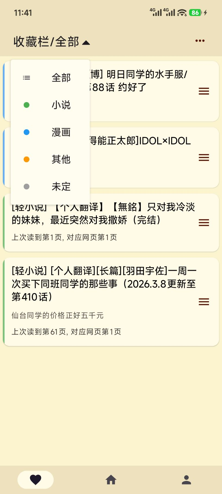

# 300百合会论坛阅读器

为百合会论坛小说和漫画提供更好的阅读体验，支持常见小说阅读器的功能，支持原生的漫画阅读功能。

系统要求: Android 7.0 及以上

## 内容列表

- [已知问题](#已知问题)
- [软件下载](#软件下载)
- [软件截图](#软件截图)
- [相比原项目的重大升级](#相比原项目的重大升级)
- [第三方开源库](#第三方开源库)
- [如何贡献](#如何贡献)
- [使用许可](#使用许可)

## 已知问题

1. 我没有多个账号，换账号使用可能会出问题，有问题可以把软件数据清除。
2. 如果你觉得加载卡住了，建议重进一次页面或重启软件，不过大概率是网络问题。
3. 首次安装软件后，加载漫画可能会需要一会时间，之后会正常
4. 小说横屏翻页和竖屏下滑切换时可能会有大幅度的页面偏移，但应该没人经常换这东西。

## 软件下载

[Github Release](https://github.com/prprbell/YamiboReaderPro/releases)

[度盘](https://pan.baidu.com/s/15EZiwp0Z5z8qrg1Gd4IIlA?pwd=yuri)

## 软件截图

<table>
  <tr>
    <td></td>
    <td></td>
    <td></td>
    <td></td>
    <td></td>
    <td></td>
  </tr>
  <tr>
    <td></td>
    <td></td>
    <td></td>
    <td></td>
    <td></td>
    <td></td>
  </tr>
  <tr>
    <td></td>
    <td></td>
    <td></td>
    <td></td>
    <td></td>
    <td></td>
  </tr>
</table>

## 相比原项目的重大升级

本项目脱胎于 [flben233/YamiboReader](https://github.com/flben233/YamiboReader)，在其基础架构上进行了大规模重构与功能增强，旨在提供更流畅、方便的百合会小说与漫画阅读体验。
> **从原版迁移须知**
> 
> 本项目保留了原版项目的包名，但使用了新的开发者签名。如果手机上安装了原版YamiboReader，请卸载后再安装本项目。
> 

主要特性与升级包括：
1. 小说阅读体验与性能优化

- 预加载：快读完当前页面时，自动后台加载下一页内容。
- 内存缓存：基于 `LruCache` 实现已读页面在内存中缓存。
- 本地缓存：缓存小说到本地，告别网络加载。
- 现代化UI：弹窗设置升级为工具栏，操作更现代。
- 夜间模式：支持小说阅读界面的深色主题。
- 图片加载开关：可选是否加载帖子图片，提升加载速度。（完全不建议开启）
- 阅读模式：横屏翻页 or 竖直下滑。
- 背景颜色改变：可以换小说背景颜色。
- 自动提取章节目录：识别章节标题（每楼第一行）构建目录。
- 刷新按钮：可通过刷新按钮进行网络请求，更新内容与收藏栏标题。
- 去往原贴：可一键跳转至原贴
- 简繁转换：可在原文、简体、繁体间切换

2. 全新漫画阅读模式

- 全新漫画阅读页面：实现原生漫画阅读界面，支持亮度调节、左右滑动、竖屏下滑、手势缩放。
- 漫画目录与进度记录：在收藏夹自动记录漫画阅读进度，自动抓取漫画标题并根据生成漫画目录，可校正、更新。

3. 收藏夹功能强化

- 拖拽排序：长按收藏项，可拖拽自由调整顺序。
- 自动刷新：每次进入收藏夹页面会进行刷新，亦可手动刷新。
- 隐藏作品：可以选择在收藏栏选中作品进行隐藏/显示。
- 收藏智能分类：点击收藏夹链接时，会自动在后台判断目标页面是小说、漫画还是普通论坛界面，并重定向到最适合的界面，同时支持分类查看。
- 书签、目录和缓存管理：可通过收藏页面管理书签、目录和缓存。

## 第三方开源库

* **UI 架构**: [Jetpack Compose](https://developer.android.com/jetpack/compose)
* **网络请求**: [Retrofit](https://github.com/square/retrofit) & [OkHttp3](https://github.com/square/okhttp)
* **HTML 解析**: [Jsoup](https://github.com/jhy/jsoup)
* **JSON 解析**: [FastJSON2](https://github.com/alibaba/fastjson2)
* **图片加载**: [Coil](https://github.com/coil-kt/coil)
* **手势与拖拽排序**: [Reorderable](https://github.com/Calvin-LL/Reorderable)
* **简繁转换**: [android-opencc](https://github.com/qichuan/android-opencc)
* **图片手势缩放**: [Telephoto (Zoomable)](https://github.com/saket/telephoto)

## 维护者与鸣谢

**维护者：** [@prprbell](https://github.com/prprbell)

**鸣谢：** 本项目基于 [flben233/YamiboReader](https://github.com/flben233/YamiboReader) 的基础框架进行开发，感谢原作者 [@flben233](https://github.com/flben233) 出色的工作！

## 如何贡献

[提一个 Issue](https://github.com/prprbell/YamiboReaderPro/issues/new) 

## 使用许可

本项目采用 [AGPL 3.0](LICENSE) 许可证进行授权。 © prprbell

